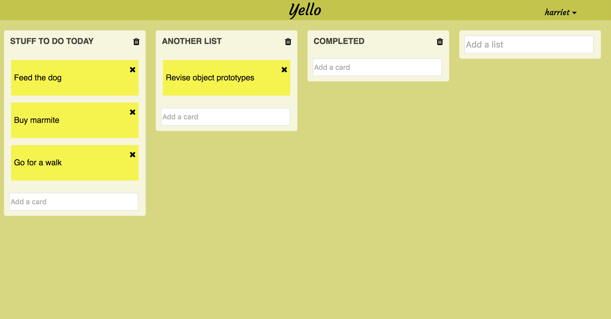

## Yello
#### The Trello board for people who like dubious shades of yellow

My first experiments with Meteor.

A basic CRUD app where user can login to add, update and delete lists and cards, in the format of a Trello board.

TODO: implement React Drag & Drop to allow user to move cards between lists

